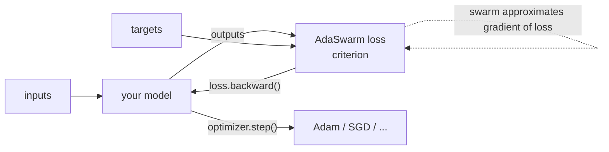

<!---
Licensed under the Apache License, Version 2.0 (the "License");
you may not use this file except in compliance with the License.
You may obtain a copy of the License at

    http://www.apache.org/licenses/LICENSE-2.0

Unless required by applicable law or agreed to in writing, software
distributed under the License is distributed on an "AS IS" BASIS,
WITHOUT WARRANTIES OR CONDITIONS OF ANY KIND, either express or implied.
See the License for the specific language governing permissions and
limitations under the License.
-->

# AdaSwarm

[](https://github.com/AdaSwarm/AdaSwarm/actions/workflows/build.yml)
[](https://pypi.org/project/adaswarm/)
[](https://github.com/AdaSwarm/AdaSwarm)
[](LICENSE)

This repo purportedly implements *AdaSwarm*, an optimizer, that combines Gradient Descent and Particle Swarms. 

*AdaSwarm* is based on "AdaSwarm: Augmenting Gradient-Based optimizers in Deep Learning with Swarm Intelligence, _Rohan Mohapatra, Snehanshu Saha, Carlos A. Coello Coello, Anwesh Bhattacharya Soma S. Dhavala, and Sriparna Saha_", to appear in IEEE Transactions on Emerging Topics in Computational Intelligence. An arXiv version can be found [here](https://arxiv.org/abs/2006.09875). [This](https://github.com/rohanmohapatra/pytorch-cifar) repo contains implementation used the paper.

---

## ⚡ TL;DR

**AdaSwarm is a drop-in _loss function_.** You keep your normal optimiser (e.g. `Adam`) and your
normal training loop — you only swap the criterion.

[](https://colab.research.google.com/github/AdaSwarm/AdaSwarm/blob/main/examples/quickstart.ipynb)

```python
import torch
import adaswarm.nn

criterion = adaswarm.nn.BCELoss()                        # swarm-based loss (or CrossEntropyLoss)
optimizer = torch.optim.Adam(model.parameters(), lr=0.1) # your usual optimiser

for inputs, targets in loader:
    optimizer.zero_grad()
    loss = criterion(model(inputs), targets)             # <-- the only change vs standard training
    loss.backward()
    optimizer.step()
```

- Use `adaswarm.nn.BCELoss()` for binary / one-hot targets (tabular problems).
- Use `adaswarm.nn.CrossEntropyLoss()` for multi-class classification (e.g. images).
- Use `adaswarm.nn.SwarmLoss(loss_fn)` for **any** custom / non-convex / non-differentiable loss (see [When is AdaSwarm actually better?](#-when-is-adaswarm-actually-better-and-when-it-isnt)).

## 🚀 Quickstart (60 seconds)

```bash
# 1. Get the code and install (uses uv: https://docs.astral.sh/uv/)
git clone https://github.com/AdaSwarm/AdaSwarm.git
cd AdaSwarm
uv sync --extra examples

# 2. See the two things AdaSwarm can do that plain gradient descent cannot
uv run python examples/why_adaswarm.py
```

This runs a head-to-head against plain Adam on identical model/data/init and shows AdaSwarm
(1) escaping a deceptive local minimum, and (2) training through a **non-differentiable** loss where
Adam cannot move. Prefer a narrated, visual walkthrough with plots? Open
[`examples/why_adaswarm.ipynb`](examples/why_adaswarm.ipynb) locally or
[in Colab](https://colab.research.google.com/github/AdaSwarm/AdaSwarm/blob/main/examples/why_adaswarm.ipynb).

> **Just want the basic API on a classic dataset?** See the Iris basic-usage example
> ([`examples/quickstart.py`](examples/quickstart.py) /
> [notebook](examples/quickstart.ipynb) /
> [Colab](https://colab.research.google.com/github/AdaSwarm/AdaSwarm/blob/main/examples/quickstart.ipynb)).

## 🧠 Mental model: where AdaSwarm plugs in



AdaSwarm runs an internal particle swarm over the loss to approximate its gradient, then hands control
straight back to your standard optimiser via `loss.backward()`. Nothing else in your loop changes.

---

## 🎯 When is AdaSwarm actually better? (and when it isn't)

AdaSwarm is a **niche tool, not a general Adam replacement.** Because it optimises via a swarm over
candidate outputs — only ever *evaluating* the loss, never differentiating it — it wins in exactly two
situations, and loses (on cost) everywhere else.

| Output loss | Standard Adam | AdaSwarm | Use AdaSwarm? |
|---|---|---|---|
| Smooth & convex (MSE, cross-entropy, BCE) | ✅ optimal & cheap | ~parity, slower | ❌ no |
| Convex but non-smooth (MAE, pinball, hinge) | ✅ subgradient works | ~parity | ❌ not needed |
| **Non-convex / multi-modal** (deceptive local minima) | ❌ gets stuck | ✅ escapes | ✅ **yes** |
| **Non-differentiable / black-box** (zero-gradient, discrete metrics) | ❌ can't train | ✅ trains | ✅ **yes** |

The general-purpose entry point is **`adaswarm.nn.SwarmLoss(loss_fn)`**, which accepts any elementwise loss:

```python
import adaswarm.nn
criterion = adaswarm.nn.SwarmLoss(my_elementwise_loss)  # loss_fn(pred, target) -> per-element tensor
loss = criterion(model(x), y)
loss.backward()   # standard optimiser step from here
```

See [`examples/why_adaswarm.ipynb`](examples/why_adaswarm.ipynb) for a head-to-head demo where, on
identical model/data/init, Adam stalls (local minimum / zero gradient) and AdaSwarm reaches the target.

**Where this shows up in the real world:** phase retrieval & phase unwrapping, audio pitch (octave
errors), direction-of-arrival & pose/rotation losses (periodic → multi-modal); directly optimising
discrete metrics (F1, AUC, IoU, WER), simulator-in-the-loop training, quantised-output fitting
(non-differentiable); and multi-modal scientific fitting (spectral peaks, stiff-PDE residuals in PINNs).
See [**docs/use-cases.md**](docs/use-cases.md) for the full catalogue with per-domain detail.

**Cost caveat:** each step runs a swarm over the output space, so it scales with output dimension ×
swarm size × iterations — best for low-dimensional per-sample outputs, not large softmaxes.

---

## Why *AdaSwarm*:
Said  et  al.  [[1]](#1)  postulated  that  swarms behavior is similar to  that of classical  and  quantum  particles.  In  fact, their analogy is so striking that one may think that the social and  individual  intelligence  components  in  Swarms  are,  after  all, nice useful metaphors, and that there is a neat underlying dynamical system at play. This dynamical system perspective was indeed useful in unifying two almost parallel streams, namely, optimization  and  Markov  Chain  Monte  Carlo  sampling. 

In a seminal paper, Wellington and Teh [[2]](#2), showed that a  stochastic  gradient  descent  (SGD)  optimization  technique can  be  turned  into  a  sampling  technique  by  just  adding noise,  governed  by  Langevin  dynamics.  Recently,  Soma  and Sato [[3]](#3) provided further insights into this connection based on  an  underlying  dynamical  system  governed  by  stochastic differential equations (SDEs). 

While these results are new, the connections  between  derivative-free  optimization  techniques based on Stochastic Approximation and Finite Differences are well documented [[4]](#4). Such strong connections between these seemingly  different  subfields  of  optimization  and  sampling made  us  wonder:  Is  there  a  larger,  more  general  template, of which  the  aforementioned  approaches  are  special  cases, exist? *AdaSwarm* is a result of that deliberation.

We believe that it is just a beginning of a new breed of **composable optimizers**

## What is *AdaSwarm* in simple terms, in the context Deep Learning:
1. Setup
    - ``y``: responses
    - ``f(.)`` is a model specified by a network with parameters ``w``
    - ``f(x)``is the prediction at observed feature ``x``
    - ``L(.)`` is loss, to drive the optimization

2. Approximate gradients of ``L(.)`` w.r.t ``f(.)``
    - run an independent Swarm optimizer over ``L(.)`` with particle dimension equal to the size of the network's output layer
    - using swarm particle parameters, approximate the gradient of  ``L(.)`` w.r.t ``f(.)``

3. Get gradients of ``f(.)`` w.r.t ``w``
    - using standard ``AutoDiff``, via chain rule, get the approximate gradient of ``f(.)`` w.r.t ``w``

4. Approximate gradients of ``L(.)`` w.r.t ``w`` via Chain Rule
    - take the product of gradients in steps (2) and (3)

5. Updates the network weights via standard Back Propagation

## Why does it work? Minor changes are meaningful!

At this time, we could embellish the fact that Swarm, by being a meta-heuristic algorithm, has less tendency to get trapped in local minimal or has better exploration capabilities. It is helping the problem overall. Secondly, entire information about the "learning" the task comes from the loss, and the function ``f(.)`` only specifies the structural relationship between input and output. Moreover, the ability of EMPSO, the first step toward AdaSwarm facilitates exploration and exploitation equally by using a modified formulation leveraging exponentially averaged velocities and by not ignoring past velocities. It is these velocities (which are different at different stages in the search space) that make the difference at local minima successfully by being able to differentiate between stagnating regions/saddle points and true local minima. Particular objects of interest are the equivalence theorems, such as the following:

"partial derivative of the loss wrt the weights" can be expressed in terms of Swarm parameters thus keeping tight control over the hyper-parameters and not tuning those at all for convergence. This addresses a common complaint about meta-heuristics.


So, having better "optimization" capabilities at the loss, in general, are going to be helpful. While we have ample empirical evidence that shows that *AdaSwarm* is working well, we also have some theory (not complete but enough to offer the convergence insights, particularly from the point of robust loss functions such as MAE and irregular losses used to solve PDEs/PDEs such as the Schrodinger Equation). 

Another speculation, speculation at this time, is that, to the best of our knowledge, all current optimization techniques only harvest information coming from a single paradigm. *AdaSwarm*, whereas, combines different perspectives, like in an ensemble. More than an ensemble, it is a composition -- where different perspectives get chained. That is one fundamental difference between *AdaSwarm* and other population-based techniques.

In someways, just like an neural network architecture is composed of several layers, *AdaSwarm* is a composition of optmizers. That composition eventually fits into the chain rule.

As a result, the changes are very small. Same is the case with Adam and RMSProp, right? Other notable examples, where we see pronounced differences in speed/convergence, with very simple changes in the maps are:
- _Proximal gradient descent_ vs _Accelerated Proximal gradient descent_
- _Euler_ vs _LeapFrog_ 
_ ...

Therefore, in order to better understand, and develop the theory and tools for composable optimizers, we have to develop both theoretical and computational tools to understand why and where *AdaSwarm* works. Along the way, make such optimizers accessible to the community.

## Adaswarm Equivalence of Gradients: Why is it happening?

The equivalences are driven by the following equations in the main text (cf. docs/papers folder): 

Eqns (4)-(6), (15), (18) and the eqn below for non-differentiable loss and (20)-(24)

## Objectives:

1. Develop a plug-and-play optimizer that works with
    - other optimizers in the PyTorch ecosystem, along side the likes of ``Adam``, ``RMSProp``, ``SGD``
    - any architecture 
    - any dataset
    - with the same api as others, i.e., ``optim.AdaSwarm()``

2. Battle test on variety of
    - test objectives functions
    - datasets
    - architectures (Transformers, MLPs,..)
    - losses (BCE, CCE, MSE, MAE, CheckLoss,...)
    - paradigms (RIL, Active Learning, Supervised Learning etc..)
    - etc..

3. Provide insights into the workings of *AdaSwarm* by
    - analyzing the workings of the optimizers
    - visualizing the path trajectories
    - etc..

4. Most importantly, be community driven
    - there is lot of enthusiasm and interest in the recent graduates and undergraduates, that want to learn ML/AI technologies. Instead of fiddling with MNIST datasets, and predicting Cats and Dogs, do something foundational and meaningful. If you take offence to statement, you are not ready for this project.
    - turn this into a truly community-driven effort to offer a useable, useful, foundational building block to the deep learning ecosystem

## How to run this project

### Pre-requisites

* Python 3.10+
* [uv](https://docs.astral.sh/uv/) (recommended) — a fast Python package/-project manager

### Get the source

```bash
git clone https://github.com/AdaSwarm/AdaSwarm.git
cd AdaSwarm
```

### Install

```bash
uv sync                 # core library only
uv sync --extra examples   # + torchvision/matplotlib/jupyter for the examples & notebook
```

### Run the examples

```bash
uv run python examples/why_adaswarm.py   # the "why it works" showcase
uv run python examples/quickstart.py     # basic API on the Iris dataset
```

### Run the tests

```bash
uv run pytest
```

### Using in your own project

```bash
pip install adaswarm
# or with uv:
uv add adaswarm
```

Then use it exactly like the [TL;DR](#-tldr) above. See
[`examples/quickstart.py`](examples/quickstart.py) for a complete, runnable script.

## ❓ FAQ / Troubleshooting

**"I expected `optim.AdaSwarm()` — where is the optimizer?"**
AdaSwarm is currently exposed as a **loss function** (`adaswarm.nn.BCELoss()` /
`adaswarm.nn.CrossEntropyLoss()`) used together with a standard optimiser such as `torch.optim.Adam`.
There is no `optim.AdaSwarm()` class yet. See the [TL;DR](#-tldr).

**Install fails with a `torch`/`torchvision` version conflict.**
This was caused by old, over-tight version pins and is fixed on the current `main`. Make sure you are
installing the latest version (which requires Python ≥ 3.10 and `torch` ≥ 2.2).

**Which loss do I use?**
`BCELoss()` for binary/one-hot tabular targets; `CrossEntropyLoss()` for multi-class problems.


## Contributing:

1. While we are yet to establish the policy to contribute, we will follow how any Apache open source project works. For example, see airflow project's [contribution](https://github.com/apache/airflow/blob/master/CONTRIBUTING.rst) guidelines. 

2. [tbd] 
    - developer slack channel will be coming soon
    - we will hold weekly zoom/meet at specific times (off office hours, so anybody can join)
 
 
2. But be mindful. There may not be any no short-term rewards. 
    - Research is bloody hard work. There will not be any instant gratification or recognition for the work. Expect lot of negative results, and set backs.
    - Optimization problems are generally hard, and writing an Engineering level framework that works on _any_ problem is even harder. It is scientific computing, not writing hello world examples.
    - So take a plunge only if you are willing to endure the pain, w/o worrying about the end result.


## References
<a id="1">[1]</a> 
S. M. Mikki and A. A. Kishk, Particle Swarm Optimizaton: A Physics-Based Approach.    Morgan & Claypool, 2008.

<a id="2">[2]</a> 
M.  Welling  and  Y.  W.  Teh,  “Bayesian  learning  via  stochastic  gradient langevin dynamics,”In Proceedings of the 28th International Conference on Machine Learning, p. 681–688, 2011.

<a id="3">[3]</a> 
S.  Yokoi  and  I.  Sato,  “Bayesian  interpretation  of  SGD  as  Ito  process,” ArXiv, vol. abs/1911.09011, 201.

<a id="3">[4]</a> 
J.  Spall, Introduction  to  stochastic  search  and  optimization. Wiley-Interscience, 2003

## Citation

*AdaSwarm* will be appearing in the [paper](https://arxiv.org/abs/2006.09875) you can cite:
```bibtex
@inproceedings{adaswarm,
    title = "AdaSwarm: Augmenting Gradient-Based optimizers in Deep Learning with Swarm Intelligence",
    author = "Rohan Mohapatra and Snehanshu Saha and Carlos A. Coello Coello and Anwesh Bhattacharya and Soma S. Dhavala and Sriparna Saha",
    booktitle = "IEEE Transactions on Emerging Topics in Computational Intelligence",
    year = "2021",
    publisher = "IEEE",
    url = "https://arxiv.org/abs/2006.09875"
}
```
